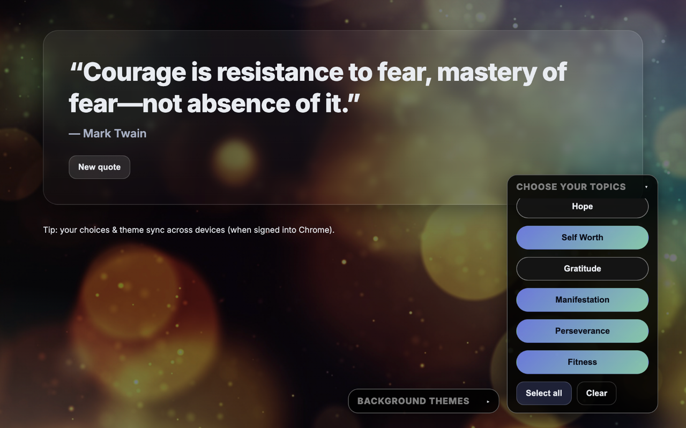

# Tailored Motivator Tab (Chrome MV3)

Start every tab with a calm, inspiring quote — tailored to the themes you care about — on top of soothing photo backgrounds. Preferences sync across your signed-in Chrome profile.

> **Single purpose:** This extension replaces the default New Tab page with an inspirational quote and a minimal settings dock for topics and backgrounds.

---

## ✨ Features

- **Topic filters:** Self Esteem, Self Love, Self Worth, Courage, Perseverance, Hope, Gratitude, Finance, Manifestation, Fitness, Biblical (KJV)
- **Beautiful backgrounds:** 10 calming photo themes (user-selectable)
- **Quick refresh:** “New quote” button for another hit of motivation
- **Syncs across devices:** Uses `chrome.storage.sync` for topics + theme
- **Privacy-friendly:** No tracking, no ads, no search hijacking, works offline

---

## 📸 Screenshot



*(If your filename is different, change `screenshot.png` to match.)*

---

## 📦 Install (Unpacked for Development)

1. Clone/download this repo.
2. In Chrome, open `chrome://extensions`.
3. Toggle **Developer mode** (top right).
4. Click **Load unpacked** → select the project folder (the one with `manifest.json` at the root).
5. Open a new tab to see it in action.

---

## 🚀 Package for the Chrome Web Store

Zip the folder **from inside the project directory** so `manifest.json` is at the zip root.

**macOS/Linux**
```bash
cd /path/to/project
zip -Xr ../inspiring-newtab.zip . -x "*/.*" "__MACOSX/*"
